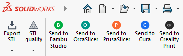
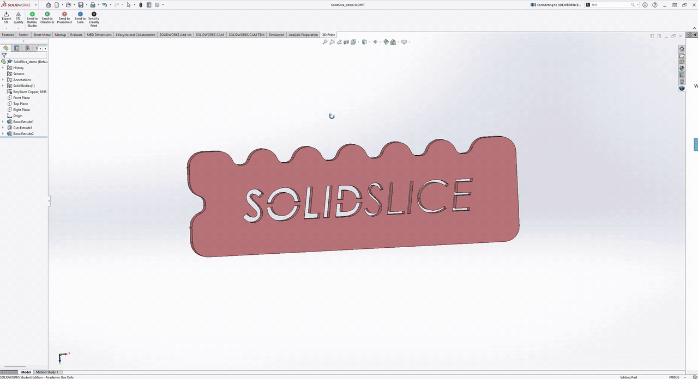

# SolidSlice – 3D Print tab for SolidWorks

<p align="center"></p>

<p align="center"></p>

A SolidWorks add-in that adds a **3D Print** tab (and menu) to parts and assemblies:

- **Export STL** (dropdown):
  - **Save next to part**: saves the STL in the part's folder, with no dialog
  - **Choose location...**: pick the folder and file name yourself. The add-in remembers
    the last folder you used.
- **STL quality** (dropdown): the triangle resolution for **every** export, both Export STL
  and all slicer buttons. The current choice is marked with ✓.
  - **Set it once:** your choice is saved and used for all later exports, even after
    restarting SolidWorks, until you pick a different preset.
  - **Your own settings stay untouched:** SolidWorks' built-in STL options
    (*File → Save As → STL → Options*) are not changed. The preset applies only to
    SolidSlice exports, so a manual *Save As → STL* behaves exactly as before.

  | Preset | Max deviation | Max angle |
  |---|---|---|
  | SolidWorks setting (default) | your *File → Save As → STL → Options* | |
  | Draft | 0.1 mm | 20° |
  | Normal | 0.03 mm | 10° |
  | High | 0.01 mm | 5° |
  | Ultra | 0.002 mm | 2° |

- **One button per installed slicer**: exports the model and opens it in that slicer.

Supported slicers (a button only appears if the slicer is installed):

| Slicer | Status |
|---|---|
| Bambu Studio | tested (2.07) |
| PrusaSlicer | tested |
| OrcaSlicer | tested |
| UltiMaker Cura | tested (5.13) |
| Creality Print | tested (7.3) |

> **Tip:** by default every click opens a **new slicer window**. To send models into the
> window that's already open, turn on your slicer's single-instance setting once. See
> [Use one slicer window](#use-one-slicer-window-instead-of-opening-a-new-one-each-time).

## Requirements

- Windows, 64-bit
- SOLIDWORKS (developed on 2025; any recent version with the .NET API should work)
- At least one of the slicers above if you want the "send to" buttons
- .NET Framework 4.x (preinstalled on Windows 10/11). Visual Studio is **not** required.

## Install

1. Download or clone this repository (`git clone <repo-url> solidslice`).
2. Close SolidWorks.
3. Double-click **`install.cmd`** and accept the admin prompt. It compiles the add-in
   against your local SolidWorks API and registers it.
4. Start SolidWorks. The **3D Print** tab appears in parts and assemblies. If it doesn't,
   enable the add-in under **Tools → Add-Ins**.

To remove it, run **`uninstall.cmd`**.

If SolidWorks is installed somewhere unusual and the build can't find it, run
`powershell -ExecutionPolicy Bypass -File build.ps1 -SolidWorksDir "D:\path\to\SOLIDWORKS"`
first, then run `install.cmd`.

Slicers are detected each time SolidWorks starts. After installing a new slicer,
restart SolidWorks and its button appears.

## Use one slicer window instead of opening a new one each time

The add-in opens the exported model with the slicer, just like double-clicking an STL.
Whether that starts a **new window** or adds the model to the **window that's already
open** is decided by the slicer itself. Most slicers open a new window by default. To
reuse the open window, change this setting once:

| Slicer | Setting |
|---|---|
| Bambu Studio | Preferences → General → ☑ *Keep only one Bambu Studio instance* |
| OrcaSlicer | Preferences → General → ☑ *Allow only one OrcaSlicer instance* |
| PrusaSlicer | Configuration → Preferences → ☑ *Allow just a single PrusaSlicer instance* |
| UltiMaker Cura | Preferences → General → ☑ *Use a single instance of Cura* (restart Cura) |
| Creality Print | No option in its preferences. Close Creality Print, open `%APPDATA%\Creality\Creality Print\<version>\Creality.conf` in a text editor, and change `"single_instance": false` to `"single_instance": true` |

Leave the setting off if you prefer a fresh slicer window for every part.

## How it works

- **STL format:** STLs are always binary, in millimetres, and a single file for assemblies,
  with the triangle resolution from the **STL quality** dropdown.
  Your SolidWorks STL export settings are restored afterwards. If you're not using the
  Default configuration, its name is added to the file name.
- **Export STL** writes `<part folder>\<part name>.stl` and overwrites any existing file.
  Unsaved documents ask for a location. **Choose location...** opens a save dialog that
  starts in the last folder you used (stored in `HKCU\Software\SolidSlice\LastExportFolder`).
  Both options are also in the **3D Print** menu.
- **Send to slicer** writes to `%TEMP%\SolidSlice\` and starts the slicer with that file.

### Slicer not detected?

Slicers are found through the Windows *Installed apps* list and the default
Program Files folders. For portable or unusual installs, set the path manually:

```
reg add HKCU\Software\SolidSlice\Slicers /v "OrcaSlicer" /d "D:\Tools\OrcaSlicer\orca-slicer.exe"
```

The value name must match the button name (`Bambu Studio`, `OrcaSlicer`, `PrusaSlicer`,
`Cura`, `Creality Print`).

### Adding another slicer

Add an entry to `Slicer.All` in [`src/Slicers.cs`](src/Slicers.cs) with its name,
installer display name, exe name, default folder, and icon color and letter.
Then run `install.cmd` again.

## Tips

- **Faceted curves?** Pick *High* or *Ultra* in the **STL quality** dropdown.
  **Huge files or a slow slicer?** Go down to *Normal* or *Draft*.
- To rebuild after changing the code, close SolidWorks first, because it locks the DLL.

## License

[MIT](LICENSE) © 2026 Georgs Narbuts

---

SolidSlice is an independent project and is not affiliated with Dassault Systèmes
(SOLIDWORKS), Bambu Lab, Prusa Research, UltiMaker, Creality or the OrcaSlicer project.
